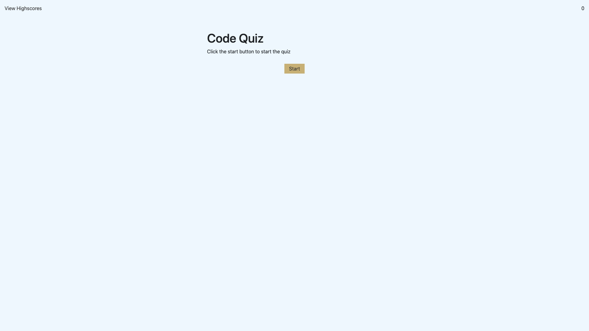

# Code Quiz

This is a timed code quiz where the user gets multiple choice questions.

---

## Table of Contents

1. [Built With](#Built-With)
2. [Features](#Features)
3. [Website](#Website)

---

## Built With

* HTML
* CSS
* JavaScript

---

## Features

* Click the start button to begin the quiz
* A timer should start and and a question appears
* The user is presented with a new question after answering
* If the users answer is wrong, time will be subtracted from the clock
* The quiz is over when timer reaches 0 or all questions are answered
* The user can sumbit initials to view in score list

---

## Website

[Visit the website](https://samersaemeldahr.github.io/Code-Quiz/)